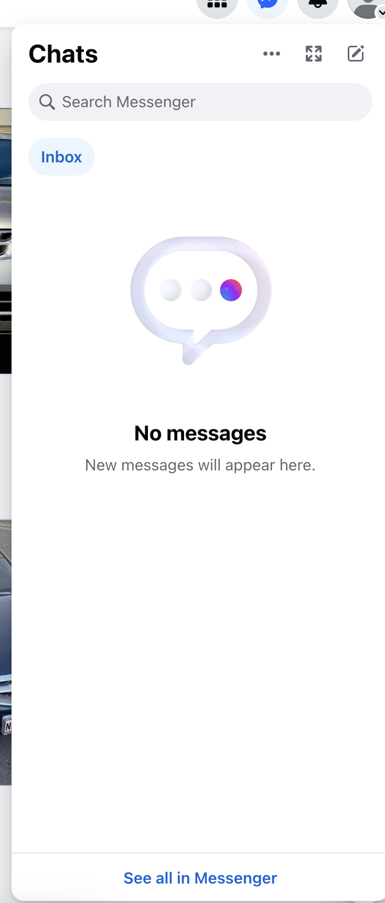
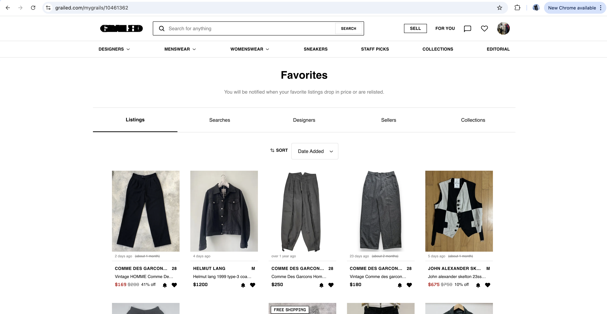
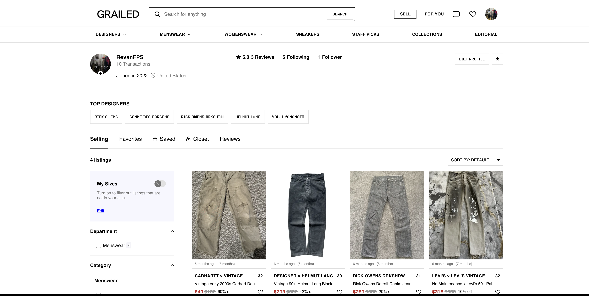
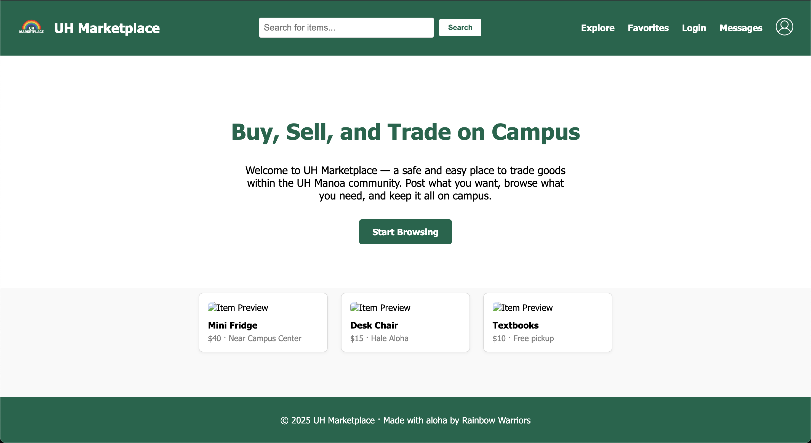
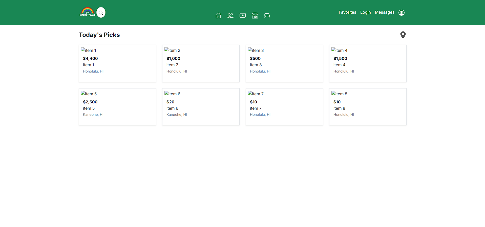
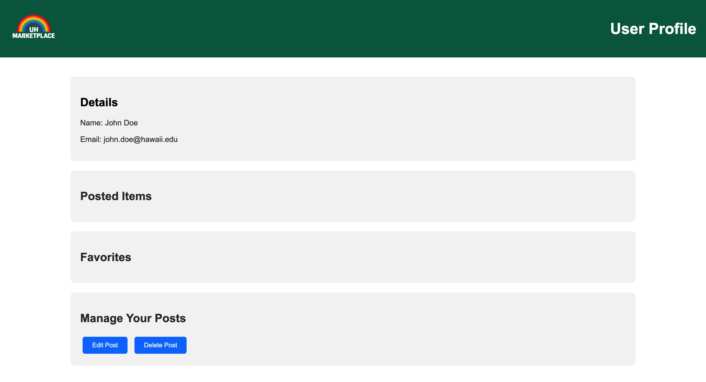
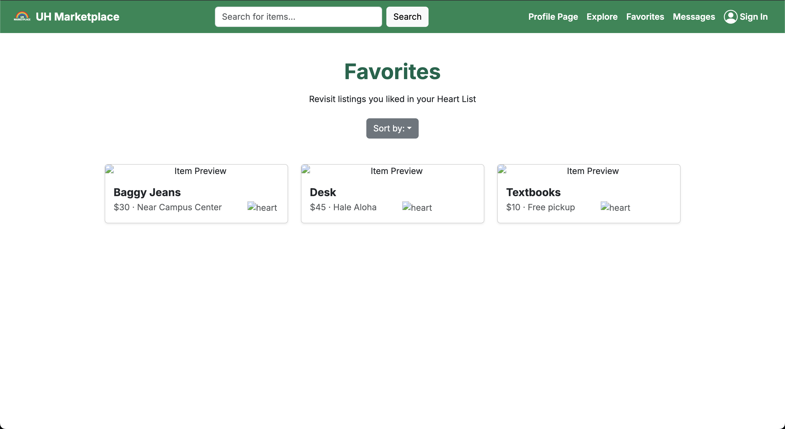
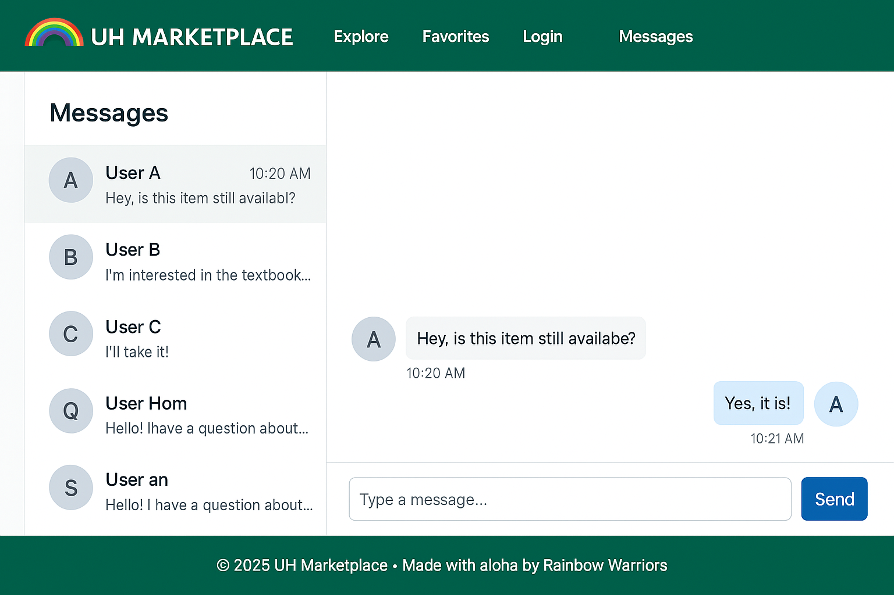

# UH Marketplace
- [UH Marketplace Homepage](https://uh-marketplace.github.io/)
- [UH Marketplace Application Repository](https://github.com/uh-marketplace/uh-marketplace-app)
- [UH Marketplace Organization](https://github.com/uh-marketplace)
- [Deployed App Link](https://uh-marketplace-app.vercel.app/)

## Table of Contents

* [Overview](#overview)
* [Deployment](#deployment)
* [User Guide](#user-guide)
* [Mockup Pages](#mockup-pages)
* [Features](#features)
* [UH Manoa Focus](#uh-manoa-focus)
* [Milestones](#milestones)
* [Team](#team)

---

## Overview

UH Marketplace is a UH Manoa-exclusive online marketplace designed for students and faculty to buy, sell, and trade items like textbooks, furniture, electronics, clothes, and more. This app fosters sustainability, convenience, and campus connection by allowing only UH-verified users to post and explore listings.

Unlike general platforms like Facebook Marketplace, UH Marketplace prioritizes **security, simplicity, and community**—every user is authenticated with a `@hawaii.edu` email, and all transactions are arranged outside the app after users connect through in-app messaging.

---

## Deployment

[UH Marketplace]() <!-- add link to deployed application in parethesis -->will be deployed using **Vercel**, ensuring fast and reliable delivery of the app. Our project codebase is maintained in GitHub and built using Next.js and Bootstrap 5.

GitHub Pages will be used to host this homepage (`uh-marketplace.github.io`) with updates about the platform and progress.

---

## User Guide 
<!-- Each step should have a screenshot(eventually) and remove mockup pages since screenshots should be in User Guide -->

1. **Sign Up** with your `@hawaii.edu` email.
2. **Create a Profile** with basic information and contact preferences.
3. **Post Items** for sale or trade, including photos, descriptions, and prices.
4. **Explore Listings** using filters for category, price, date posted, and more.
5. **Favorite Items** to save them to your account's "heart list."
6. **Message Sellers** via private chat to arrange a trade or purchase.
7. **Mark Posts as Sold/Traded** after the deal is completed.

---

## Mockup Pages

### Landing Page
  
  Intro, login, and call-to-action

  

### Explore Page
  
  Browse all listings with filter chips (e.g., Clothes, Textbooks)
  
  
  
### Item Detail Page

Photo carousel, description, price, seller info, message button

### Post Item Page

Upload pictures, select category, enter details

### Messages Page

Chat interface with all message threads

  

### Favorites Page

  User’s saved/hearted items

  
  
### Profile Page

Manage active listings and account preferences

  

---

## Features

- Verified @hawaii.edu login only
- Clean, categorized item listings with filtering and sorting
- “Sold/Traded” toggle for completed posts
- In-app messaging for secure communication
- Personal favorites collection (heart button)
- Responsive design using **Bootstrap 5**
- Search bar for quick access to specific items
- Admin moderation and reporting tools (future roadmap)

---

## UH Manoa Focus

UH Marketplace is deeply integrated with the UH Manoa identity:
- Email verification restricted to @hawaii.edu domains
- Interface includes UH-themed elements like rainbow icons, Mānoa green and white palette
- Designed specifically for students’ and faculty’s on-campus needs
- Encourages sustainable reuse and affordability

---

## Milestones

### [M1 Project](https://github.com/orgs/uh-marketplace/projects/6)

For Milestone 1 we focused on the visuals of our project to get our skeleton of the project up and running. Completing our landing page, mockup pages, and deploying our application to Vercel were the most important issues we had to complete for milestone 1.

[Project deployed to Vercel](https://uh-marketplace-app.vercel.app/)

Mockup Pages

<!-- Add image path in parenthesis -->

- Landing Page

 

- Explore Page
  

  
- Profile Page
  

- Favorites Page
  

- Messages Page

## [M2 Project](https://github.com/orgs/uh-marketplace/projects/7)

---

## Community Feedback

Not applicable at this time as UH Marketplace is currently in development.

---

## Team

UH Marketplace is the result of a collaborative effort by [Hargun Juneja](https://coderfps.github.io), [Josh Golez](https://jetg0.github.io/), [Erhan Huang](https://erhan-huang23.github.io/), [Bryan Nakasone](https://bryannak.github.io/), [Koalani Okada](https://koalanik.github.io/), and [Jane Davis]().

### [Team Contract](https://docs.google.com/document/d/1Qr5srEUYRbho0C7N1dZCK7TkM8Z79O9a-bVXQLBjdUc/edit?usp=sharing)
---

> 🌈 UH Marketplace – A sustainable way to trade on campus. Built with aloha by UH Manoa students.
