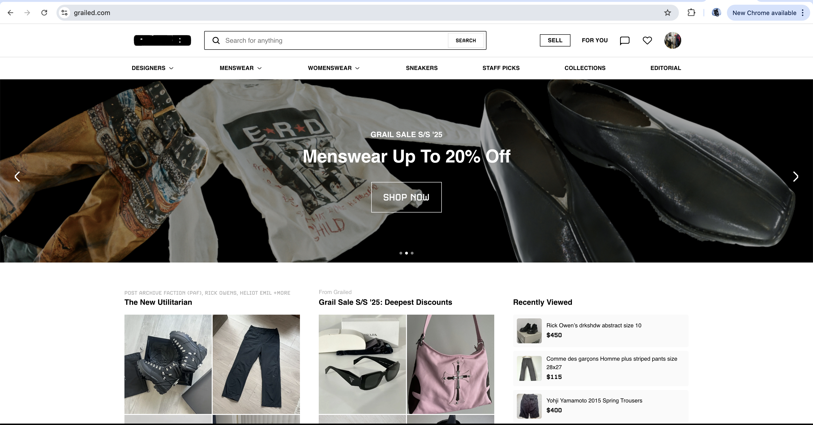

# UH Marketplace
- [UH Marketplace Homepage](https://uh-marketplace.github.io/)
- [UH Marketplace Application Repository](https://github.com/uh-marketplace/uh-marketplace-app)
- [UH Marketplace Organization](https://github.com/uh-marketplace)
- [Deployed App Link](https://uh-marketplace-app.vercel.app/)

## Table of Contents

* [Overview](#overview)
* [Deployment](#deployment)
* [User Guide](#user-guide)
* [Mockup Pages](#mockup-pages)
* [Features](#features)
* [UH Manoa Focus](#uh-manoa-focus)
* [Milestones](#milestones)
* [Team](#team)

---

## Overview

UH Marketplace is a UH Manoa-exclusive online marketplace designed for students and faculty to buy, sell, and trade items like textbooks, furniture, electronics, clothes, and more. This app fosters sustainability, convenience, and campus connection by allowing only UH-verified users to post and explore listings.

Unlike general platforms like Facebook Marketplace, UH Marketplace prioritizes **security, simplicity, and community**—every user is authenticated with a `@hawaii.edu` email, and all transactions are arranged outside the app after users connect through in-app messaging.

---

## Deployment

[UH Marketplace]() <!-- add link to deployed application in parethesis -->will be deployed using **Vercel**, ensuring fast and reliable delivery of the app. Our project codebase is maintained in GitHub and built using Next.js and Bootstrap 5.

GitHub Pages will be used to host this homepage (`uh-marketplace.github.io`) with updates about the platform and progress.

[](https://github.com/uh-marketplace/uh-marketplace-app/actions/workflows/ci.yml)

---

## User Guide 
<!-- Each step should have a screenshot(eventually) and remove mockup pages since screenshots should be in User Guide -->

1. **Sign Up** with your `@hawaii.edu` email.
2. **Create a Profile** with basic information and contact preferences.
3. **Post Items** for sale or trade, including photos, descriptions, and prices.
4. **Explore Listings** using filters for category, price, date posted, and more.
5. **Favorite Items** to save them to your account's "heart list."
6. **Message Sellers** via private chat to arrange a trade or purchase.
7. **Mark Posts as Sold/Traded** after the deal is completed.

---

## Mockup Pages

### Landing Page
  
  Intro, login, and call-to-action

  

### Explore Page
  
  Browse all listings with filter chips (e.g., Clothes, Textbooks)
  
  
  
### Item Detail Page

Photo carousel, description, price, seller info, message button

### Post Item Page

Upload pictures, select category, enter details


### Favorites Page

  User’s saved/hearted items

  
  
### Profile Page

Manage active listings and account preferences

  

---

## Features

- Verified @hawaii.edu login only
- Clean, categorized item listings with filtering and sorting
- “Sold/Traded” toggle for completed posts
- In-app messaging for secure communication
- Personal favorites collection (heart button)
- Responsive design using **Bootstrap 5**
- Search bar for quick access to specific items
- Admin moderation and reporting tools (future roadmap)

---

## UH Manoa Focus

UH Marketplace is deeply integrated with the UH Manoa identity:
- Email verification restricted to @hawaii.edu domains
- Interface includes UH-themed elements like rainbow icons, Mānoa green and white palette
- Designed specifically for students’ and faculty’s on-campus needs
- Encourages sustainable reuse and affordability

---

## Milestones

### [M1 Project](https://github.com/orgs/uh-marketplace/projects/6)

For Milestone 1 we focused on the visuals of our project to get our skeleton of the project up and running. Completing our landing page, mockup pages, and deploying our application to Vercel were the most important issues we had to complete for milestone 1.

[Project deployed to Vercel](https://uh-marketplace-app.vercel.app/)

Mockup Pages

<!-- Add image path in parenthesis -->

- Landing Page

 


- Explore Page
  


  
- Profile Page
  


- Favorites Page
  


- Messages Page


## [M2 Project](https://github.com/orgs/uh-marketplace/projects/7)

For Milestone 2 we focused on core functionality by integrating the database and implementing key user features. Creating the Explore, Favorites, Profile, and Messages pages, enabling users to read and write data, and setting up Playwright tests and CI on GitHub Actions were the most important issues we had to complete for milestone 2.

- Add Page – [Live Page](https://uh-marketplace-app.vercel.app/add)  
  

- Explore Page – [Live Page](https://uh-marketplace-app.vercel.app/explore)  
  

- Landing Page – [Live Page](https://uh-marketplace-app.vercel.app)  
  
  Every button works.
---

## [M3 Project](https://github.com/orgs/uh-marketplace/projects/8/views/1?layout=board)

For Milestone 3, we focused on enhancing the overall functionality and user experience of our application as we approached the final stages of the project. This included refining existing features, addressing bugs, and optimizing performance to ensure a seamless experience for our users. We gathered and integrated real data into our database, allowing us to validate the system's functionality with realistic scenarios and improve its reliability. These efforts brought us closer to delivering a polished and fully functional product.

- [Landing Page](https://uh-marketplace-app.vercel.app/)


- [Explore Page](https://uh-marketplace-app.vercel.app/explore)


  
- [Profile Page](https://uh-marketplace-app.vercel.app/profile)


- Profile Page (Other Accounts)


- [Favorites Page](https://uh-marketplace-app.vercel.app/favorites)


- []()

## Development

First, [install PostgreSQL](https://www.postgresql.org/download/). Then create a database for your application.

```

$ createdb nextjs-application-template
Password:
$

```

Second, go to [https://github.com/uh-marketplace/uh-marketplace-app](https://github.com/uh-marketplace/uh-marketplace-app), and click the "Code" button. You can either clone the repo thru Github Desktop or with git clone to download the repo to your local file system.

Third, cd into the directory of your local copy of the repo, and install third party libraries with:

```

$ npm install

```

Fifth, create a `.env` file from the `sample.env`. Set the `DATABASE_URL` variable to match your PostgreSQL database that you created in the first step. See the Prisma docs [Connect your database](https://www.prisma.io/docs/getting-started/setup-prisma/add-to-existing-project/relational-databases/connect-your-database-typescript-postgresql). Then run the Prisma migration `npx prisma migrate dev` to set up the PostgreSQL tables.

```

$ npx prisma migrate dev
Environment variables loaded from .env
Prisma schema loaded from prisma/schema.prisma
Datasource "db": PostgreSQL database "<your database name>", schema "public" at "localhost:5432"

Applying migration `20240708195109_init`

The following migration(s) have been applied:

migrations/
└─ 20240708195109_init/
└─ migration.sql

Your database is now in sync with your schema.

✔ Generated Prisma Client (v5.16.1) to ./node_modules/@prisma/client in 51ms

$

```

Then seed the database with the `/config/settings.development.json` data using `npx prisma db seed`.

```

$ npx prisma db seed
Environment variables loaded from .env
Running seed command `ts-node --compiler-options {"module":"CommonJS"} prisma/seed.ts` ...
Seeding the database
  Creating user: admin@foo.com with role: ADMIN
  Creating user: john@foo.com with role: USER
  Adding stuff: {"name":"Basket","quantity":3,"owner":"john@foo.com","condition":"excellent"}
  Adding stuff: {"name":"Bicycle","quantity":2,"owner":"john@foo.com","condition":"poor"}
  Adding stuff: {"name":"Banana","quantity":2,"owner":"admin@foo.com","condition":"good"}
  Adding stuff: {"name":"Boogie Board","quantity":2,"owner":"admin@foo.com","condition":"excellent"}
  Adding item: {"name":"Keyboard","condition":"fair","price":199.99,"location":"Campus Center","owner":"john@foo.com","imageUrl":"https://images.unsplash.com/photo-1618384887929-16ec33fab9ef?q=80&w=2960&auto=format&fit=crop&ixlib=rb-4.0.3&ixid=M3wxMjA3fDB8MHxwaG90by1wYWdlfHx8fGVufDB8fHx8fA%3D%3D","description":"Used Keychron K2 Mechanical Wireless Keyboard."}
  Adding item: {"name":"Laptop","condition":"good","price":899.99,"location":"Hamilton Library","owner":"admin@foo.com","imageUrl":"https://images.unsplash.com/photo-1517336714731-489689fd1ca8?q=80&w=2960&auto=format&fit=crop&ixlib=rb-4.0.3&ixid=M3wxMjA3fDB8MHxwaG90by1wYWdlfHx8fGVufDB8fHx8fA%3D%3D","description":"Lightly used M1 Macbook Air with 16GB RAM and 512GB SSD."}
  Adding item: {"name":"Headphones","condition":"excellent","price":299.99,"location":"Paradise Palms","owner":"john@foo.com","imageUrl":"https://images.unsplash.com/photo-1517841905240-472988babdf9?q=80&w=2960&auto=format&fit=crop&ixlib=rb-4.0.3&ixid=M3wxMjA3fDB8MHxwaG90by1wYWdlfHx8fGVufDB8fHx8fA%3D%3D","description":"Sony WH-1000XM4 noise-canceling headphones."}
🌱 Seeding complete

🌱  The seed command has been executed.
$

```

### Running the system

Once the libraries are installed and the database seeded, you can run the application by invoking the "dev" script:

```

$ npm run dev

> nextjs-application-template-1@0.1.0 dev
> next dev

▲ Next.js 14.2.4

- Local: http://localhost:3000
- Environments: .env

✓ Starting...
✓ Ready in 1619ms

```

### Viewing the running app

If all goes well, the template application will appear at [http://localhost:3000](http://localhost:3000). You can login using the credentials in [settings.development.json](https://github.com/uh-marketplace/uh-marketplace-app/blob/main/config/settings.development.json), or else register a new account.

### ESLint

You can verify that the code obeys our coding standards by running ESLint over the code in the src/ directory with:

```
$ npm run lint

> nextjs-application-template-1@0.1.0 lint
> next lint

✔ No ESLint warnings or errors
$
```

## Community Feedback

Quang: Good: "Easy to use UI Bad: Needs to have more options for the user like for example, add like a credibility feature so people don’t get scammed."

Donnie: "The UI is really clean and easy to navigate. I dont like how it sends you to the add a product page after you register, i think it should send u to the home page. I like how theres a search bar and a favorites page but a small thing is when u look at someones profile all their listings are marked as favorited idk if that was intentional. Another small thing is i think clicking on the picture should also open up the little window
but overall very nice."

Kendric: "Interface is nice, easy to naviagte good colorway, but when adding an item personally, the containers are too close in the profile section."


---

## Team

UH Marketplace is the result of a collaborative effort by [Hargun Juneja](https://coderfps.github.io), [Josh Golez](https://jetg0.github.io/), [Erhan Huang](https://erhan-huang23.github.io/), [Bryan Nakasone](https://bryannak.github.io/), [Koalani Okada](https://koalanik.github.io/), and [Jane Davis]().

### [Team Contract](https://docs.google.com/document/d/1Qr5srEUYRbho0C7N1dZCK7TkM8Z79O9a-bVXQLBjdUc/edit?usp=sharing)
---

> 🌈 UH Marketplace – A sustainable way to trade on campus. Built with aloha by UH Manoa students.
